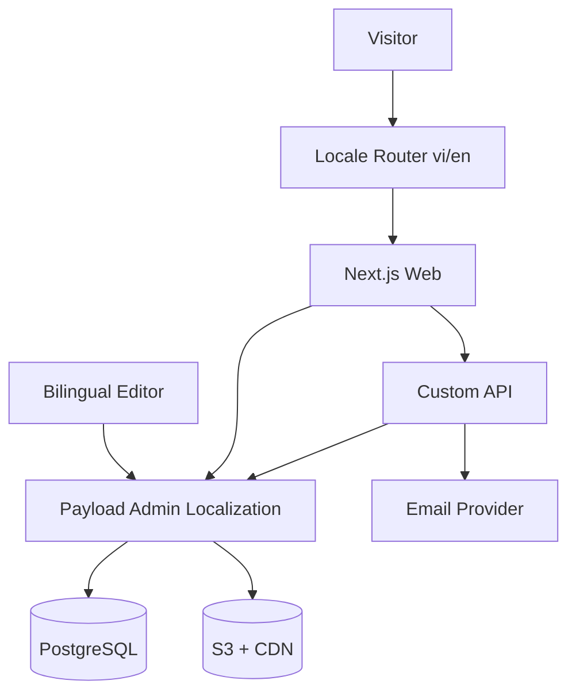

# TECHNOLOGY STACK & ARCHITECTURE DECISION RECORD

## 1. Trạng thái

**Accepted for Bilingual MVP V3.0.** Website hỗ trợ Tiếng Việt (`vi`) và English (`en`) ngay trong MVP. Thay đổi locale, URL strategy hoặc fallback policy phải có ADR bổ sung.

## 2. Ngôn ngữ lập trình

- TypeScript cho frontend, CMS, API và scripts.
- SQL do Payload migration tạo và phần SQL kiểm tra có kiểm soát.
- HTML/CSS được sinh qua React; Tailwind CSS và CSS variables triển khai design system.
- JSON/TypeScript dictionaries dùng cho UI text; nội dung biên tập được localized trong Payload CMS.

## 3. Stack chốt

| Lớp | Công nghệ | Vai trò |
|---|---|---|
| Web | Next.js App Router | SSR/SSG, routing, metadata |
| UI | React + TypeScript | Component và interaction |
| CMS | Payload CMS 3.x Localization | Nội dung `vi`/`en`, admin, schema, access, migration |
| i18n routing | Next.js `app/[lang]` | URL `/vi` và `/en`, locale validation |
| UI translation | Server-only dictionaries | Navigation, form labels, system messages |
| Database | PostgreSQL | Dữ liệu quan hệ |
| Media | S3-compatible + CDN | File, image transformation/delivery |
| Validation | Zod + Payload validation | Biên API và CMS |
| Email | Transactional email provider | Thông báo form |
| Testing | Vitest + Playwright | Unit/integration/E2E |
| CI/CD | GitHub Actions tương đương | Lint, typecheck, test, build, deploy |

## 4. Kiến trúc logic



## 5. Quyết định kiến trúc song ngữ

### 5.1. Locale contract

- Supported locales: `vi`, `en`.
- Default locale: `vi`.
- Mọi public page nằm trong `app/[lang]/...`; giá trị ngoài allowlist trả `404`.
- `/` chuyển hướng đến `/vi`. Hệ thống có thể ưu tiên lựa chọn đã lưu; không ép đổi locale khi người dùng đang truy cập một URL có locale rõ ràng.
- Thuộc tính `<html lang>` luôn khớp locale hiện tại.

### 5.2. Phân tách loại nội dung

| Loại text | Nguồn | Ví dụ |
|---|---|---|
| UI/system copy | Server-only dictionaries `vi`/`en` | Menu, button, validation, 404 |
| Editorial content | Payload localized fields | Page, service, project, article |
| Taxonomy labels | Payload localized fields | Category, service name |
| Legal content | Payload localized + approval riêng | Privacy, terms, consent |
| User input | Lưu nguyên bản + `submissionLocale` | Contact message |

Không đưa nội dung dài của CMS vào dictionary và không hard-code bản dịch trong React component.

### 5.3. Payload localization

- Cấu hình `locales: ['vi', 'en']`, `defaultLocale: 'vi'`.
- Các field cần localized: title, slug, summary, rich text/blocks, CTA label, SEO title, meta description, alt text và taxonomy label.
- Các field không localized: ID, trạng thái quyền media, ngày tạo, client internal reference, metrics raw value và audit fields.
- Fallback trong Admin có thể hỗ trợ biên tập, nhưng public query sử dụng `fallbackLocale: false` cho nội dung bắt buộc để không âm thầm trộn tiếng Việt vào trang English.
- Publication readiness được kiểm tra riêng theo locale bằng validation/hook hoặc workflow field.

### 5.4. Slug và liên kết tương đương

- Slug được localized để hỗ trợ SEO tự nhiên cho từng ngôn ngữ.
- Hai URL locale vẫn tham chiếu cùng một document Payload; language switcher truy vấn localized slug của document đó.
- Slug phải unique trong collection theo locale.
- Nếu locale đích chưa được publish, language switcher về homepage locale đích kèm thông báo; không tạo URL 404 có chủ đích.

## 6. Quyết định dữ liệu

- Payload là chủ sở hữu schema và migration.
- MVP dùng ID số của adapter PostgreSQL; API công khai không hứa UUID.
- Không dùng Prisma song song vì tạo hai nguồn schema.
- Mọi truy cập Local API ngoài tác vụ tin cậy phải đặt `overrideAccess: false`.
- Không chỉnh trực tiếp database production.
- Contact request lưu `submissionLocale` (`vi` hoặc `en`) để chọn email template, acknowledgement và báo cáo chuyển đổi.
- Không nhân đôi collection thành `pages_vi` và `pages_en`; dùng Payload field localization để giữ một content identity.

## 7. Rendering, cache và revalidation theo locale

| Loại trang | Cách render | Cache/invalidation |
|---|---|---|
| `/{lang}` home/service/about | Static/ISR | Tag gồm collection + locale |
| Project/article list | ISR | Tag theo collection + locale + filter taxonomy |
| Project/article detail | ISR | Tag theo document ID + locale |
| Contact | Static + client form | Không cache POST |
| Preview | Dynamic, authenticated, locale-aware | `no-store`, `noindex` |

- `generateStaticParams` tạo `vi` và `en` cho route-level locale.
- Publish/unpublish chỉ revalidate locale bị thay đổi và các listing liên quan.
- Cache key luôn bao gồm locale để không trả nhầm ngôn ngữ.

## 8. SEO và discovery song ngữ

- `generateMetadata` đọc SEO fields đúng locale.
- Mỗi URL có self-canonical.
- Metadata alternates khai báo `vi`, `en` và `x-default` khi phiên bản tương ứng đã publish.
- Sitemap chỉ chứa locale đã publish và biểu diễn quan hệ alternate.
- Open Graph locale: `vi_VN` hoặc `en_US`/biến thể được business chốt; alternate locale tương ứng.
- Structured data dùng nội dung cùng ngôn ngữ với trang.
- Redirect service hiểu prefix locale và phải ngăn loop/cross-locale redirect ngoài ý muốn.

## 9. Language switcher và preference

- Language switcher tạo URL server-side từ document identity và localized slug, không thay chuỗi slug bằng thao tác thủ công.
- Preference cookie/local storage chỉ là gợi ý khi vào `/`; URL có locale luôn là nguồn quyết định.
- Cookie preference là functional cookie, được mô tả trong privacy notice.
- Không tự động chuyển người dùng khỏi `/vi/...` hoặc `/en/...` dựa trên IP/geolocation.

## 10. Form, email và analytics

- Form label, validation và success/error messages lấy từ dictionary theo locale.
- API nhận `submissionLocale` nhưng validate bằng allowlist; không tin locale tùy ý từ client.
- Email nội bộ chứa locale nguồn; acknowledgement template dùng đúng locale.
- Analytics event có `locale`, `contentId` và route template; không gửi PII hoặc toàn bộ localized text.
- KPI conversion, organic sessions và missing translation được phân tích theo locale.

## 11. Quyết định bảo mật

- Payload REST/GraphQL create cho lead/consent không được public.
- Public submission chỉ qua custom endpoint có validation, rate limit và idempotency.
- Admin bắt buộc TLS, strong password; MFA/SSO khi hạ tầng hỗ trợ.
- GraphQL Playground tắt ở production nếu không dùng.
- Secret chỉ qua secret manager, không commit `.env`.
- Locale parameter, localized slug và redirect destination đều phải validate; không dùng locale input để import file tùy ý.
- Preview token gắn document, locale và expiry; không cho phép đổi locale để xem bản dịch chưa được cấp quyền.

## 12. Cấu trúc mã nguồn đề xuất

```text
src/
  app/
    [lang]/
      layout.tsx
      page.tsx
      about/page.tsx
      services/page.tsx
      projects/[slug]/page.tsx
      insights/[slug]/page.tsx
      contact/page.tsx
  i18n/
    config.ts
    dictionaries.ts
    vi.json
    en.json
  lib/
    locale.ts
    localized-url.ts
    metadata.ts
    payload-content.ts
```

Dictionary được load server-only và kiểm tra cùng một tập key trong CI.

## 13. Môi trường

- Local: app + PostgreSQL + S3 emulator hoặc bucket dev.
- Staging: giống production, dữ liệu giả/đã ẩn danh.
- Production: managed PostgreSQL, S3, CDN, monitoring và backup.
- Trong Docker, hostname database là `postgres`, không phải `127.0.0.1`.
- Seed/staging phải có cả `vi` và `en` để test routing, fallback, sitemap và revalidation.

## 14. Testing bắt buộc cho song ngữ

- Locale ngoài allowlist trả 404.
- `/` chuyển hướng đúng; URL có locale không bị tự động đổi.
- Language switcher đi đúng localized slug và không tạo 404.
- Thiếu bản dịch bắt buộc không bị fallback âm thầm trên public page.
- Canonical, `hreflang`, sitemap và structured data đúng từng locale.
- Cache/revalidation không trả content `vi` cho route `en` hoặc ngược lại.
- Form, email, validation và analytics sử dụng đúng `submissionLocale`.
- Dictionary `vi`/`en` không thiếu hoặc thừa key ngoài allowlist được duyệt.

## 15. Khả năng mở rộng

Worker mở rộng, search service, CRM integration và locale thứ ba chỉ thêm khi có nhu cầu đo được. Kiến trúc locale dùng allowlist để có thể bổ sung ngôn ngữ mới bằng ADR, migration nội dung, SEO mapping và QA đầy đủ; không tự động coi locale mới là đã sẵn sàng chỉ vì CMS hỗ trợ.

## 16. Acceptance criteria của ADR

- `/vi` và `/en` render độc lập với `<html lang>` đúng.
- Payload trả localized content đúng locale và không trộn fallback ngoài policy.
- Editor thấy trạng thái completeness/approval của từng locale.
- Language switcher giữ đúng document context.
- SEO alternate và sitemap vượt qua kiểm tra tự động.
- Typecheck, lint, unit, integration, E2E và production build đều đạt.
