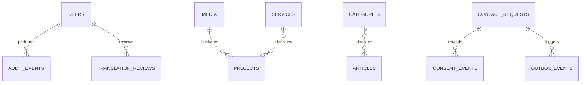

# POSTGRESQL DATABASE DESIGN — PAYLOAD ALIGNED

**Phiên bản:** Bilingual MVP V3.0  
**Locales:** `vi`, `en`; default `vi`

## 1. Nguyên tắc

Payload config là nguồn schema. Database design này mô tả logical model, không thay thế migration sinh từ Payload. MVP dùng ID số nhất quán với adapter.

Website sử dụng **một document identity** cho mỗi page/service/project/article và lưu các field được chọn theo cơ chế Payload localization. Không tạo collection riêng kiểu `pages_vi` và `pages_en`. Cấu trúc vật lý do Payload PostgreSQL adapter và migration đang khóa phiên bản sinh ra; không viết tay bảng translation song song.

## 2. Locale model

| Thuộc tính | Quyết định |
|---|---|
| Supported locales | `vi`, `en` |
| Default locale | `vi` |
| Public fallback | Tắt cho field bắt buộc |
| Document identity | Dùng chung giữa các locale |
| Slug | Localized, unique theo collection + locale |
| Publication readiness | Theo document + locale |
| User input | Không dịch; lưu `submission_locale` |

### Field classification

| Nhóm | Localized | Ví dụ |
|---|---:|---|
| Editorial | Có | title, slug, summary, rich text, CTA |
| SEO | Có | SEO title, description, OG alt/caption |
| Accessibility | Có | alt, transcript/caption khi cần |
| Taxonomy label | Có | service/category name |
| Raw fact | Thường không | year, metric value, dates |
| Governance | Không | ID, rights status, audit, timestamps |
| PII/user input | Không | name, email, message |

## 3. Collections và globals

| Entity | Loại | Mục đích |
|---|---|---|
| users | Collection | Admin identity và role |
| media | Collection | Metadata file và quyền sử dụng |
| pages | Collection | Landing/static pages |
| services | Collection | Dịch vụ |
| projects | Collection | Case studies |
| articles | Collection | Insights |
| categories | Collection | Taxonomy có cấu trúc |
| contact_requests | Collection | Lead tối thiểu |
| consent_events | Collection | Bằng chứng consent append-only |
| redirects | Collection | SEO redirects |
| audit_events | Collection | Sự kiện quản trị quan trọng |
| outbox_events | Collection/table | Email và integration retry |
| site_settings | Global | Header/footer/contact/default SEO |
| translation_workflows | Logical group/fields | Completeness, review và approval từng locale |

## 4. Quan hệ chính

`TRANSLATION_REVIEWS` là logical audit model; có thể triển khai bằng collection riêng hoặc audit event tùy schema Payload cuối cùng, nhưng phải truy xuất được reviewer, locale, state và timestamp.

## 5. Localized content model

### pages

- Không localized: `id`, template, global publication controls, timestamps.
- Localized: `title`, `slug`, `layout`, `seo.title`, `seo.description`, social copy và accessibility text.
- Locale workflow: `translation_state`, `approved_by`, `approved_at`, `published_at` theo `vi`/`en`.

### services/categories

- Localized: name/title, slug, summary, body, deliverables, CTA label và SEO.
- Không localized: sort order, internal code, relationships và governance fields.
- Filter URL nên dùng stable taxonomy identifier; display label lấy theo locale.

### articles

- Localized: title, slug, excerpt, body, category label relation output, SEO.
- Shared hoặc localized theo business rule: author, featured media, publish dates.
- Một locale chưa publish không được xuất hiện trong listing/sitemap locale đó.

## 6. Field cốt lõi

### projects

`id`, localized `title`, localized `slug`, locale publication state, `is_public`, localized `client_display_name`, `year`, `services`, localized `summary`, localized `content_blocks`, `featured_media`, `metrics[]`, localized `seo`, timestamps.

Mỗi metric gồm localized `label`, raw `value`, localized `unit`, `is_public`, internal `source_note`. Public query phải lọc metric không public trước serialization cho cả hai locale.

### contact_requests

`id`, `public_reference`, `name`, `company`, `email`, `phone`, `service_interest_code`, `message`, `submission_locale`, `policy_version`, `status`, `source_url`, `utm`, `ip_hash`, `user_agent`, `idempotency_key_hash`, timestamps.

`submission_locale` bắt buộc thuộc `vi|en`; message lưu nguyên văn. `service_interest_code` dùng stable code, label được resolve theo locale ở UI/email.

### consent_events

`id`, `contact_request_id`, `consent_type`, `policy_version`, `consent_locale`, `granted`, `occurred_at`, `ip_hash`, `user_agent`. Không update/delete qua admin thông thường. `consent_locale` chứng minh ngôn ngữ của legal copy mà visitor đã xem.

### media

Ngoài field upload của Payload: `rights_status`, `rights_owner`, `rights_expiry`, `is_public`, localized `alt`, localized `caption`, `focal_point`, `virus_scan_status`. Media chỉ xuất hiện public ở locale khi metadata accessibility bắt buộc của locale đó đã hoàn thiện.

### redirects

`id`, `source_path`, `destination_path`, `source_locale`, `destination_locale`, status code, enabled và timestamps. Constraint/hook ngăn redirect loop, source collision và cross-locale redirect ngoài quyết định có chủ đích.

### outbox_events

Outbox payload reference lưu `template_key`, `locale`, `contact_request_id`, state, attempts và next attempt. Không sao chép toàn bộ PII vào outbox nếu worker có thể truy xuất bằng reference trong quyền hạn kiểm soát.

## 7. Constraints và indexes

- Unique: `slug` theo collection/locale; `public_reference`; hash idempotency khi còn hiệu lực.
- Index: publish status/date, project service/year, article category/date, lead created/status.
- Foreign key sử dụng restrict/set-null/cascade theo ownership; không cascade PII thiếu kiểm soát.
- Check logic ở application/Payload hook; DB constraint cho invariant quan trọng khi adapter cho phép.
- Check/validation `submission_locale` và `consent_locale` thuộc `vi|en`.
- Index phục vụ public query phải bao gồm locale/publication state theo physical schema do migration sinh.
- Unique localized slug được xác nhận bằng integration test trên cả `vi` và `en`, không chỉ dựa vào mô tả logical.

## 8. Publication và translation state

Canonical workflow cho mỗi locale:

`missing → draft → in_review → approved → published → archived`

- Không cho `published` nếu thiếu title, slug, body/template-required content, SEO, CTA, legal copy hoặc required media metadata của locale.
- Publish/unpublish một locale không tự thay đổi locale còn lại.
- Audit ghi document ID, locale, previous state, next state, actor và timestamp.
- Public selector cần đồng thời document public, locale published và quyền media hợp lệ.

## 9. PII lifecycle

- Chỉ thu dữ liệu cần thiết.
- Hash IP có salt xoay vòng; không lưu raw IP nếu không có lý do pháp lý.
- Retention contact request do doanh nghiệp/pháp lý xác nhận; job ẩn danh hoặc xóa theo policy.
- Backup thừa hưởng retention và encryption.

## 10. Transaction boundaries

Trong một transaction: tạo contact request có `submission_locale` + consent event có `consent_locale` + outbox event có email `template_key/locale`. Worker xử lý email sau commit. Retry không tạo lead mới nhờ idempotency.

## 11. Migration song ngữ

- Dev tạo migration từ Payload config.
- CI chạy migration trên database sạch, typecheck và smoke test.
- Staging backup → migrate → verify → UAT.
- Production có backup, maintenance plan và rollback theo migration cụ thể.
- Không dùng `push`/auto-sync schema cho production.
- Migration phải thêm localization bằng Payload config và generated migration; không copy tiếng Việt sang English như nội dung đã dịch.
- Dữ liệu cũ được gắn locale nguồn `vi`; field English ở trạng thái `missing/draft` cho đến khi review.
- Backfill `submission_locale` cho contact cũ bằng `vi` chỉ khi có bằng chứng route/source; nếu không xác định được thì để nullable trong giai đoạn migration và ghi `locale_migration_status=unresolved`, không đưa giá trị `unknown` vào enum public `vi|en`.
- Rehearsal kiểm tra row counts, localized slug uniqueness, draft leakage và rollback/restore.

## 12. Query contracts

- Public content query luôn truyền locale explicit và `fallbackLocale:false` cho nội dung bắt buộc.
- Admin preview có thể dùng fallback chỉ khi UI đánh dấu rõ nguồn fallback; preview không được coi là translation approved.
- Language switcher lấy localized slug từ cùng document ID.
- API serializer loại private metrics/media trước khi trả localized document.

## 13. Data acceptance criteria

- Cùng một document trả đúng title/slug/body khác nhau cho `vi` và `en`.
- Không có mixed-language fallback trên public route P0.
- Slug collision được chặn độc lập theo locale.
- Contact, consent và outbox giữ đúng locale trong một transaction.
- Sitemap/public selectors không trả locale chưa publish.
- Migration chạy trên database sạch và staging snapshot; generated schema là nguồn vật lý duy nhất.
