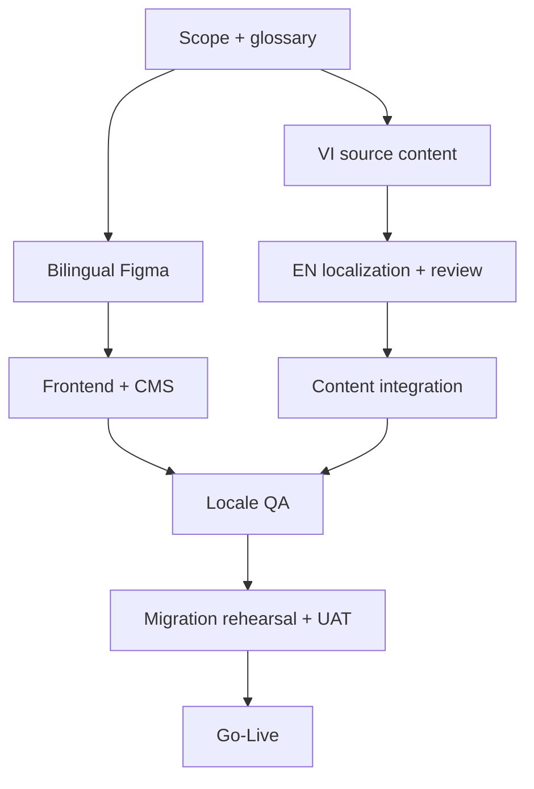

# DELIVERY ROADMAP & GO-LIVE PLAN

**Phiên bản:** Bilingual MVP V3.0  
**Launch locales:** Tiếng Việt (`vi`) và English (`en`)

## 1. Mô hình triển khai

Khuyến nghị 6 sprint, mỗi sprint 1–2 tuần tùy nguồn lực. Chỉ ước lượng chính thức sau khi content inventory, glossary, Figma `vi/en`, provider và technical spike Payload localization đạt Definition of Ready.

Không xem việc dịch English là tác vụ cuối dự án. Content source, translation, linguistic review, UI stress-test và SEO mapping phải chạy song song từ Sprint 0.

## 2. Roadmap

### Sprint 0 — Decisions & foundations

- Ký duyệt MVP song ngữ, `/vi`–`/en`, default locale, sitemap, fallback policy, ADR và roles.
- Sửa ESLint; khóa versions; setup environments, DB, S3, CI.
- Chốt design direction, bilingual inventory, source locale, glossary owner và translation workflow.
- Technical spike: Payload localized fields, localized slug, independent locale readiness/publish và migration output.
- Chốt English translator/reviewer, Legal approver và content deadlines.

### Sprint 1 — CMS & data

- Refactor Payload schema/access.
- Tạo migration V3, seed, S3 adapter.
- Admin roles cho editor/translator/reviewer/publisher, locale-aware preview và publication controls.
- Localized field matrix, translation state, `submissionLocale`, `consentLocale`, email locale.
- Test public fallback false, localized slug collision, public access và media rights.

### Sprint 2 — Design system & core pages

- Implement tokens/components/header/footer/language switcher với dictionary `vi/en`.
- Home, about, services cho cả hai locale; responsive, text expansion và accessibility.
- CMS block rendering và SEO foundations.
- Figma/prototype xác nhận same-document switching và missing-translation state.

### Sprint 3 — Projects, insights & contact

- Listing/detail templates, filters tối thiểu.
- Contact API, consent, outbox/email, rate limit/idempotency.
- Localized slug/alternates, form validation, acknowledgement email `vi/en`.
- Analytics events có locale nhưng không PII.
- Canonical, reciprocal `hreflang`, `x-default`, sitemap và structured data theo locale.

### Sprint 4 — Translation, content integration & hardening

- Nhập nội dung/media `vi`; hoàn thiện English localization và linguistic review.
- Validate glossary, SEO, alt/caption/subtitle, legal/consent và email templates.
- Content completeness dashboard đạt 100% P0 cho cả hai locale.
- Visual regression với English text expansion; không mixed-language placeholder.

### Sprint 5 — QA, UAT & launch

- Cross-browser, accessibility, performance, security, locale isolation và bilingual UAT.
- Crawl canonical/hreflang/sitemap; test switcher, fallback, cache/revalidation và email.
- Migration rehearsal, backup/restore, monitoring locale-aware và production launch.
- Smoke-test `/vi`, `/en`, contact/email và rollback cho từng locale.

## 3. RACI rút gọn

| Deliverable | Accountable | Responsible |
|---|---|---|
| Scope/SRS | Product owner | BA/PM |
| UI/Figma | Brand/design owner | UX/UI designer |
| Content approval | Content owner | Copywriter/editor |
| English localization | Content owner | Translator + English reviewer |
| Glossary/brand voice | Brand owner | UX writer + bilingual editor |
| Architecture/schema | Tech lead | Developers |
| Privacy/rights | Business/legal owner | Content/account team |
| QA/UAT | Product owner | QA + stakeholders |

## 4. Bilingual dependencies và critical path

English review, legal approval và client/media rights là critical-path dependencies. Không dồn dịch thuật vào Sprint cuối.

## 5. Go/No-Go

### No-Go nếu còn một trong các điều kiện

- Public có thể tạo lead/consent trực tiếp qua Payload API.
- Migration chưa chạy trên staging hoặc không có backup/rollback plan.
- Private metrics/media có thể lộ.
- Form không đảm bảo ghi DB trước email hoặc tạo trùng khi retry.
- Chưa có privacy notice/consent wording hoặc quyền media.
- Có defect Severity 1/2, secret lộ hoặc accessibility blocker.
- Một route P0 còn thiếu bản `vi` hoặc `en` được Approved.
- Language switcher tạo 404, lộ draft hoặc trộn locale.
- Cache/revalidation trả sai ngôn ngữ.
- Legal/consent/email template chưa đúng locale hoặc version.
- Canonical, `hreflang` hoặc sitemap sai diện rộng.

### Go khi

- 100% P0 và UAT đạt; owner ký duyệt.
- Monitoring, alert, backup/restore và support runbook sẵn sàng.
- Content/media production đều Approved.
- Smoke test production hoàn tất sau deploy.
- `/vi` và `/en` đều vượt qua visual, linguistic, accessibility, SEO và form/email UAT.
- Dashboard translation readiness, dictionary parity và missing alternate đều đạt release threshold.

## 6. Content freeze và change control

- Soft freeze source facts trước linguistic review.
- Hard freeze `vi/en`, glossary, legal copy và localized slugs tối thiểu 3 ngày làm việc trước UAT cuối.
- Sửa source fact sau freeze phải đánh dấu locale liên quan cần re-review.
- Đổi slug cần redirect cùng locale và cập nhật alternate/sitemap.
- Emergency fix production phải xác định impact cho cả hai locale.

## 7. Phase 2 backlog

- Project brief nhiều bước và private upload.
- CRM-lite, lead activities, export và integrations.
- Scheduled publishing có worker/queue.
- Locale thứ ba sau ADR, translation capacity, SEO mapping và QA đầy đủ.
- Search nâng cao, personalization hoặc client portal khi có business case.

## 8. Launch-day sequence

1. Xác nhận artifact SHA, migration version, content freeze và bilingual approvals.
2. Backup production; migrate; deploy app + worker cùng version.
3. Smoke `/vi`, `/en`, same-document switch, legal pages và system states.
4. Submit contact ở mỗi locale; xác nhận DB/consent/outbox/email đúng locale.
5. Crawl canonical/hreflang/sitemap/robots và kiểm tra analytics không PII.
6. Theo dõi error rate, outbox, missing translation, cache và Core Web Vitals theo locale.
7. Product/Tech/Content đưa ra Go hoặc kích hoạt rollback.

## 9. Success review

Review sau 7 ngày về lỗi/vận hành và locale quality; sau 30 ngày lập baseline riêng `vi/en`; sau 90 ngày đánh giá conversion, lead quality, organic visibility, language-switch behavior, missing translation, content cost và quyết định Phase 2 bằng dữ liệu.

## 10. Delivery acceptance

- Mỗi sprint có demo cả `vi` và `en`, không chỉ demo một locale rồi giả định locale còn lại hoạt động.
- Traceability nối SRS → Figma → Payload field → API → test case → approval theo locale.
- Mọi Go/No-Go gate có owner, evidence link, timestamp và sign-off.
- Website chỉ được gọi là bilingual production-ready khi implementation, content và verification đều hoàn tất cho hai locale.
